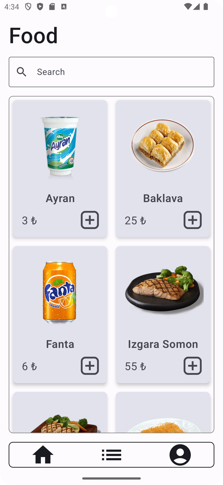
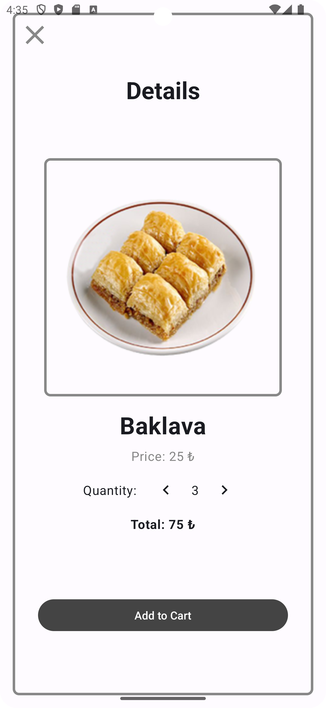
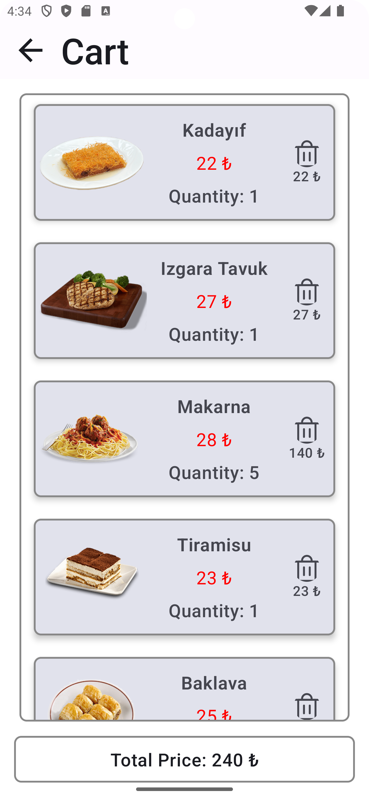
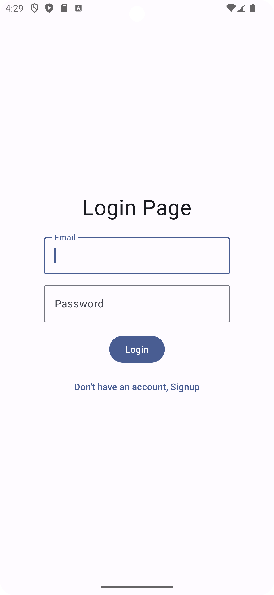
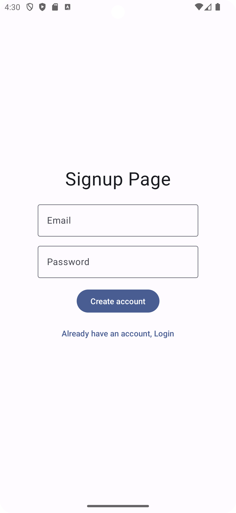
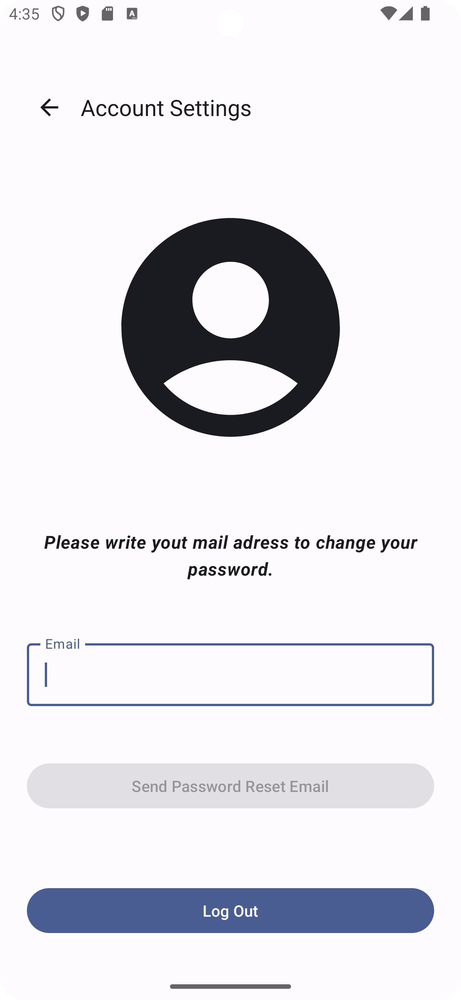

# FoodApp

[](https://developer.android.com)
[](https://kotlinlang.org)
[](https://developer.android.com/jetpack/compose)
[](https://opensource.org/licenses/MIT)

FoodApp is a modern Android application for food ordering, built with Jetpack Compose and following clean architecture principles. It showcases the use of latest Android development technologies and best practices, providing a seamless food ordering experience with user authentication, cart management, and real-time data synchronization.

## Table of Contents

- [Features](#features)
- [Screenshots](#screenshots)
- [Technology Stack](#technology-stack)
- [Architecture](#architecture)
- [Project Structure](#project-structure)
- [Setup & Installation](#setup--installation)
- [Configuration](#configuration)
- [API Documentation](#api-documentation)
- [Development Guidelines](#development-guidelines)
- [Testing](#testing)
- [Contributing](#contributing)
- [License](#license)

## Features

### Food Management
- **Browse Food Catalog**: Explore a comprehensive list of available food items
- **Food Details**: View detailed information including images, prices, and descriptions
- **Search & Filter**: Find specific dishes quickly (planned feature)

### Cart Management
- **Add to Cart**: Select items with custom quantities
- **Cart Operations**: View, update quantities, and remove items
- **Real-time Updates**: Automatic cart synchronization across sessions

### User Authentication
- **Secure Login/Register**: Email and password authentication via Firebase
- **Persistent Sessions**: Stay logged in across app restarts
- **User Profile**: Manage account information and preferences

### User Experience
- **Modern UI**: Built with Jetpack Compose for smooth animations
- **Responsive Design**: Optimized for different screen sizes
- **Offline Support**: Graceful handling of network connectivity issues
- **Error Handling**: Comprehensive error states with user-friendly messages

## Screenshots

<table>
  <tr>
    <td></td>
    <td></td>
    <td></td>
  </tr>
  <tr>
    <td></td>
    <td></td>
    <td></td>
  </tr>
</table>

## Technology Stack

### Core Technologies
- **Language**: Kotlin 2.2.0
- **Platform**: Android (Min SDK 24, Target SDK 34)
- **Build Tool**: Gradle with Kotlin DSL
- **JVM Target**: Java 17

### UI & Architecture
- **UI Framework**: Jetpack Compose (BOM 2025.05.01)
- **Architecture**: MVVM + Clean Architecture
- **Navigation**: Navigation Compose 2.7.7
- **Dependency Injection**: Dagger Hilt 2.56.2

### Networking & Data
- **HTTP Client**: Retrofit 2.9.0 + OkHttp 5.0.0-alpha.2
- **JSON Parsing**: Gson + Moshi 1.13.0
- **Image Loading**: Coil 2.2.0
- **Async Programming**: Kotlin Coroutines 1.7.3

### Backend Services
- **Authentication**: Firebase Auth 23.2.0
- **API**: Custom REST API (kasimadalan.pe.hu)

### Development Tools
- **Animations**: Lottie 6.0.0
- **Splash Screen**: Core Splash Screen 1.0.0-alpha01
- **Testing**: JUnit 4.13.2, Espresso 3.5.1

## Architecture

This project follows **Clean Architecture** principles with clear separation of concerns:

### Architecture Layers

1. **Presentation Layer** (`ui/`): Jetpack Compose screens, ViewModels, and UI state management
2. **Domain Layer** (`domain/`): Business logic and use cases
3. **Data Layer** (`data/`): Repository pattern, data sources, and models
4. **Dependency Injection** (`di/`): Hilt modules for dependency management

### Key Architectural Patterns

- **MVVM (Model-View-ViewModel)**: Separates UI logic from business logic
- **Repository Pattern**: Abstracts data sources from business logic
- **Dependency Injection**: Uses Hilt for managing dependencies
- **State Management**: Uses StateFlow and Compose state for reactive UI updates
- **Error Handling**: Centralized error handling with ResourceState wrapper

## Project Structure

```
app/src/main/java/com/example/foodapp/
├── data/                          # Data Layer
│   ├── datasource/               # Remote data sources
│   │   └── FoodsDataSource.kt   # API data source implementation
│   ├── entity/                   # Data models & DTOs
│   │   ├── Food.kt              # Food entity
│   │   ├── FoodsResponse.kt     # API response models
│   │   ├── CartFoodsResponse.kt # Cart response models
│   │   └── CRUDResponse.kt      # Generic API response
│   ├── error/                    # Error handling
│   │   └── ErrorType.kt         # Error type definitions
│   ├── local/                    # Local data storage
│   │   └── entity/              # Local database entities
│   ├── repository/               # Repository implementations
│   │   └── FoodsRepository.kt   # Main repository
│   └── ResourceState.kt          # Network state wrapper
├── di/                           # Dependency Injection
│   ├── AppModule.kt             # Hilt dependency modules
│   └── FoodApplication.kt       # Application class with Hilt
├── domain/                       # Domain Layer
│   └── service/                 # Business logic services
│       └── UserService.kt       # User management service
├── retrofit/                     # Network Layer
│   ├── ApiUtils.kt              # API configuration utilities
│   ├── FoodsDao.kt              # API endpoints interface
│   └── RetrofitClient.kt        # HTTP client configuration
└── ui/                          # Presentation Layer
    ├── components/              # Reusable UI components
    │   └── SuccessPopup.kt      # Success notification component
    ├── navigation/              # Navigation setup
    │   ├── AppNavigationGraph.kt # Main navigation graph
    │   ├── BottomNavigationBar.kt # Bottom navigation
    │   └── Routes.kt            # Route definitions
    ├── screens/                 # Screen composables
    │   ├── login/              # Authentication screens
    │   │   └── LoginPage.kt
    │   ├── signup/
    │   │   └── SignUpPage.kt
    │   ├── HomeScreen.kt        # Main food listing screen
    │   ├── DetailScreen.kt      # Food detail screen
    │   ├── CartScreen.kt        # Shopping cart screen
    │   └── AccountScreen.kt     # User profile screen
    ├── state/                   # UI state classes
    │   └── HomeUiState.kt       # Home screen state
    ├── theme/                   # App theming
    │   ├── Color.kt             # Color definitions
    │   ├── Theme.kt             # Theme configuration
    │   └── Type.kt              # Typography definitions
    └── viewmodel/               # ViewModels
        ├── HomeViewModel.kt     # Home screen logic
        ├── DetailViewModel.kt   # Detail screen logic
        └── AuthViewModel.kt     # Authentication logic
```

## Setup & Installation

### Prerequisites

- **Android Studio**: Arctic Fox (2020.3.1) or later
- **JDK**: Java 17 or later
- **Android SDK**: API level 24 or higher
- **Git**: For version control

### Installation Steps

1. **Clone the repository**:
   ```bash
   git clone https://github.com/ertuakkaya/FoodApp.git
   cd FoodApp
   ```

2. **Open in Android Studio**:
   - Launch Android Studio
   - Select "Open an existing Android Studio project"
   - Navigate to the cloned directory and select it

3. **Sync the project**:
   - Android Studio will automatically prompt to sync Gradle files
   - Click "Sync Now" when prompted

4. **Build the project**:
   ```bash
   ./gradlew build
   ```

5. **Run the application**:
   - Connect an Android device or start an emulator
   - Click the "Run" button in Android Studio or use:
   ```bash
   ./gradlew installDebug
   ```

### Build Variants

- **Debug**: Development build with debugging enabled
- **Release**: Production build with optimizations (requires signing configuration)

## Configuration

### Firebase Setup

1. **Create a Firebase project**:
   - Go to [Firebase Console](https://console.firebase.google.com/)
   - Create a new project or use an existing one

2. **Add Android app to Firebase**:
   - Click "Add app" and select Android
   - Enter package name: `com.example.foodapp`
   - Download `google-services.json`

3. **Configure Authentication**:
   - In Firebase Console, go to Authentication > Sign-in method
   - Enable "Email/Password" authentication
   - Configure authorized domains if needed

4. **Add configuration file**:
   - Place `google-services.json` in the `app/` directory
   - The file is already configured in `.gitignore` for security

### API Configuration

The app uses a custom REST API hosted at `kasimadalan.pe.hu`. No additional configuration is required for the API endpoints.

### Environment Variables

For production builds, consider setting up:
- API base URLs
- Firebase configuration
- Signing configurations

## API Documentation

### Base URL
```
http://kasimadalan.pe.hu/
```

### Endpoints

#### Get All Foods
```http
GET /yemekler/tumYemekleriGetir.php
```
**Response**: List of all available food items

#### Add Food to Cart
```http
POST /yemekler/sepeteYemekEkle.php
Content-Type: application/x-www-form-urlencoded

yemek_adi=string
yemek_resim_adi=string
yemek_fiyat=integer
yemek_siparis_adet=integer
kullanici_adi=string
```

#### Get Cart Items
```http
POST /yemekler/sepettekiYemekleriGetir.php
Content-Type: application/x-www-form-urlencoded

kullanici_adi=string
```

#### Remove from Cart
```http
POST /yemekler/sepettenYemekSil.php
Content-Type: application/x-www-form-urlencoded

sepet_yemek_id=integer
kullanici_adi=string
```

#### Food Images
```http
GET /yemekler/resimler/{food_image_name}.png
```

### Data Models

#### Food Entity
```kotlin
data class Food(
    val food_id: Int,
    val food_name: String,
    val food_image_name: String,
    val food_price: Int
)
```

#### Cart Food Entity
```kotlin
data class CartFood(
    val cart_food_id: Int,
    val food_name: String,
    val food_image_name: String,
    val food_price: Int,
    val food_order_quantity: Int,
    val user_name: String
)
```

## Development Guidelines

### Code Style

- Follow [Kotlin Coding Conventions](https://kotlinlang.org/docs/coding-conventions.html)
- Use meaningful variable and function names
- Add KDoc comments for public APIs
- Keep functions small and focused

### Git Workflow

1. Create feature branches from `main`
2. Use conventional commit messages
3. Submit pull requests for code review
4. Ensure all tests pass before merging

### Commit Message Format
```
type(scope): description

[optional body]

[optional footer]
```

Types: `feat`, `fix`, `docs`, `style`, `refactor`, `test`, `chore`

### Architecture Guidelines

- Follow Clean Architecture principles
- Use dependency injection with Hilt
- Implement proper error handling
- Write unit tests for business logic
- Use StateFlow for reactive programming

## Testing

### Unit Tests
```bash
./gradlew test
```

### Instrumentation Tests
```bash
./gradlew connectedAndroidTest
```

### Test Coverage
```bash
./gradlew jacocoTestReport
```

### Testing Strategy

- **Unit Tests**: Test ViewModels, repositories, and business logic
- **Integration Tests**: Test API interactions and data flow
- **UI Tests**: Test user interactions and screen navigation

## Contributing

We welcome contributions! Please follow these steps:

1. **Fork the repository**
2. **Create a feature branch**:
   ```bash
   git checkout -b feature/amazing-feature
   ```
3. **Make your changes**:
   - Follow coding standards
   - Add tests for new functionality
   - Update documentation as needed
4. **Commit your changes**:
   ```bash
   git commit -m 'feat: add amazing feature'
   ```
5. **Push to your branch**:
   ```bash
   git push origin feature/amazing-feature
   ```
6. **Open a Pull Request**

### Code Review Checklist

- [ ] Code follows project conventions
- [ ] Tests are included and passing
- [ ] Documentation is updated
- [ ] No breaking changes (or properly documented)
- [ ] Performance considerations addressed

## Troubleshooting

### Common Issues

1. **Build Failures**:
   - Ensure you have the correct JDK version (17)
   - Clean and rebuild: `./gradlew clean build`
   - Check for dependency conflicts

2. **Firebase Authentication Issues**:
   - Verify `google-services.json` is in the correct location
   - Check Firebase project configuration
   - Ensure authentication methods are enabled

3. **Network Issues**:
   - Check internet connectivity
   - Verify API endpoints are accessible
   - Review network security configuration

4. **Emulator Issues**:
   - Use API level 24 or higher
   - Enable hardware acceleration
   - Allocate sufficient RAM and storage

## License

This project is licensed under the MIT License - see the [LICENSE](LICENSE) file for details.

## Contact

**Ertugrul Akkaya**
- GitHub: [@ertuakkaya](https://github.com/ertuakkaya)
- Project Link: [https://github.com/ertuakkaya/FoodApp](https://github.com/ertuakkaya/FoodApp)

## Acknowledgements

- [Jetpack Compose Documentation](https://developer.android.com/jetpack/compose)
- [Firebase Documentation](https://firebase.google.com/docs)
- [Kotlin Coroutines](https://kotlinlang.org/docs/coroutines-overview.html)
- [Dagger Hilt](https://dagger.dev/hilt/)
- [Retrofit](https://square.github.io/retrofit/)
- [Coil](https://coil-kt.github.io/coil/)

---

**Note**: This project is for educational and demonstration purposes. The API endpoints used are provided by kasimadalan.pe.hu for learning purposes.